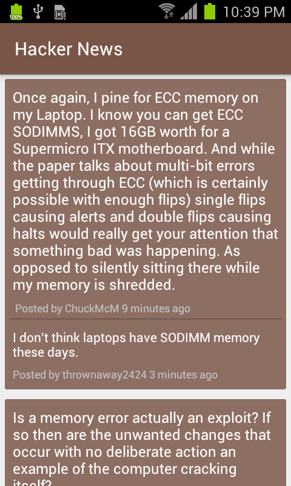

#Hacker News

##Introduction
An open-source Android application for Hacker News (YCombinator).

##Features
1. List of top stories with author and time duration since posted;
2. Read latest 10 comments and 1 latest reply for each comment;
3. Story items and comments are stored in local database, so it can be read in offline mode as well.

##Screenshots

